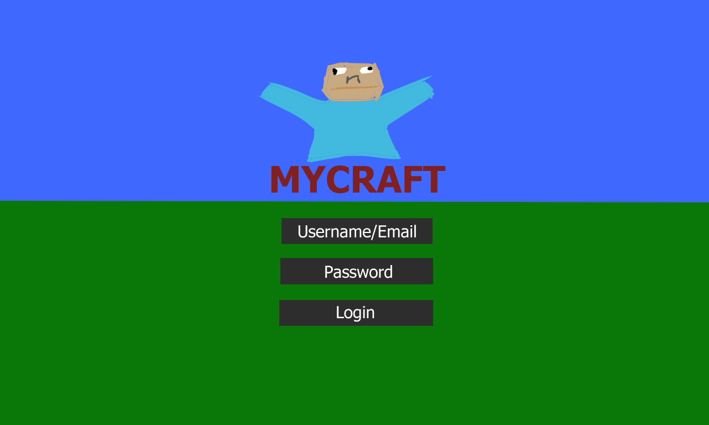
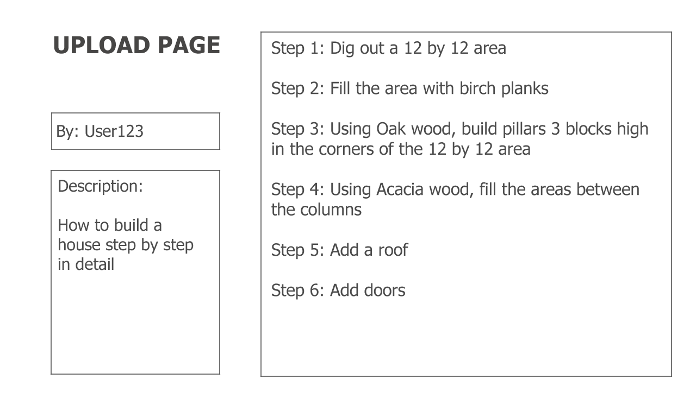
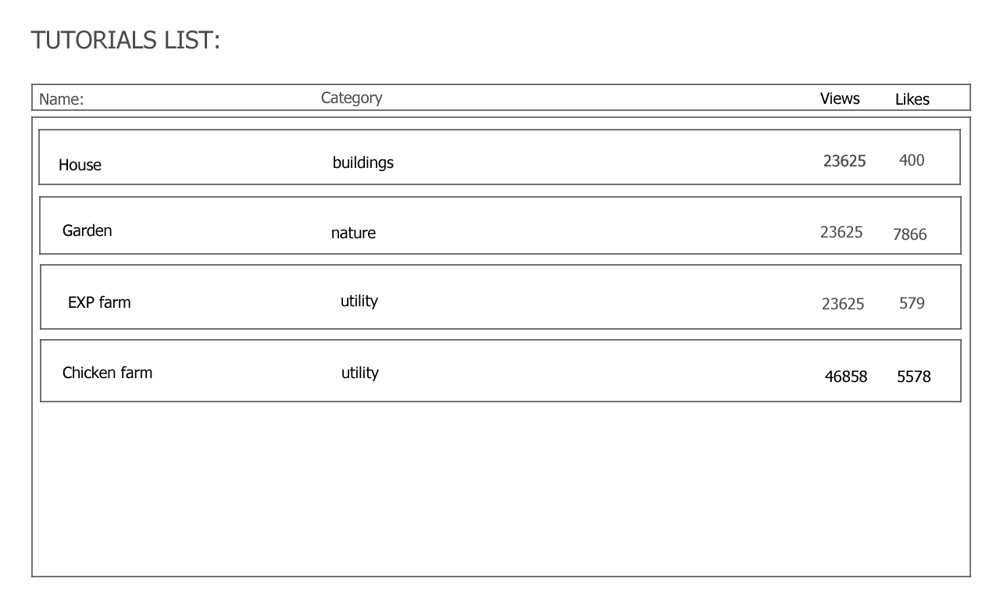
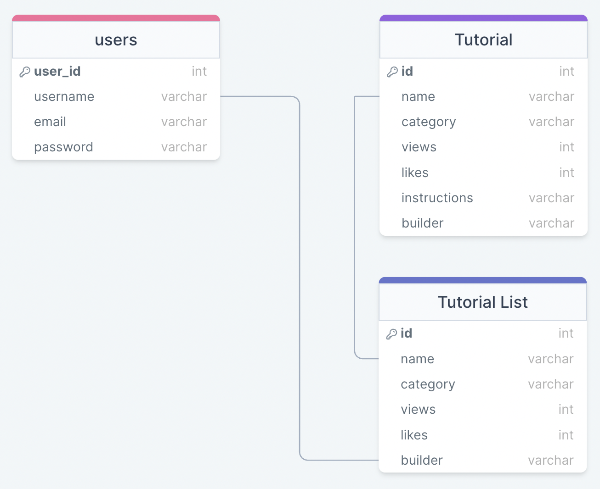

# Project Title
MyCraft

## Overview

MyCraft is a way to share and learn how to build a variety of minecraft structures

### Problem

Minecraft provides full freedom to build a myriad of structures, however, sometimes it's hard to portray the structures that you want, both aesthetically, and structurally. Sometimes, to build said structures, users might resort to online tutorials, however, these can often be drawn out, confusing, or hard to see visually, resulting in mistakes in the build. MyCraft is an app that allows users to both share, and learn how to build their desired structures.

### User Profile

Minecraft players can log into the app and search for structures that they'd like to build by category. If they are builders, they can instead navigate to the upload page to share their builds to aforementioned categories. Users may also rate the uploaded builds to ensure the quality of tutorials are regulated.

### Features

As a user, I'd like ot be able to find builds that suit my needs

As a logged-in user, I'd like ot be able to rate the builds that I find should I like, or dislike the build tutorials
As a logged-in user, I'd like to be able to upload my personal build tutorials for structures I've made

## Implementation

### Tech Stack

- React
- MySQL
- Express
- Client libraries: 
    - react
    - react-router
    - axios
- Server libraries:
    - knex
    - express
    - bcrypt for password hashing

### APIs

- No external APIs will be used for the first sprint

### Sitemap

- Home page/Login
- Upload Page
- Tutorials List Page
- Tutorial Page
- Register

### Mockups

#### Home Page/Login


#### Upload Page


#### Tutorials List Page


#### Tutorial Page


#### Register


### Data



### Endpoints

**GET /tutorials-list**

- Get a list of tutorials

Parameters:
- name: name of tutorial
- category: category depicting type of structure that is being built
- views: number of views
- likes: number of likes
- builder: username of uploader

**GET /tutorials-list/tutorial/:tutorialId**

- Get a tutorial

Parameters:
- name: name of tutorial
- category: category depicting type of structure that is being built
- views: number of views
- likes: number of likes
- instructions: set of instructions on how to complete the build
- builder: username of uploader

**POST /users/register**

- Add a user account

Parameters:

- username: User's username
- email: User's email
- password: User's provided password

Response:
```
{
    "token": "seyJhbGciOiJIUzI1NiIsInR5cCI6IkpXVCJ9.eyJzdWIiOiIxMjM0NTY3ODkwIiwibmFtZSI6I..."
}
```

**POST /users/login**

- Login a user

Parameters:
- username/email: User's username or email
- password: User's provided password

Response:
```
{
    "token": "seyJhbGciOiJIUzI1NiIsInR5cCI6IkpXVCJ9.eyJzdWIiOiIxMjM0NTY3ODkwIiwibmFtZSI6I..."
}
```

### Auth

Guest users can view tutorials, but not upload, like, nor dislike. 
Once the user logs in, they can have access to uploading, and rating. 

## Roadmap

- Set up initial client and server
    - create the necessary routes, directories, and files for both the frontend and backend
    - create migrations for backend
    - create seeds with sample café data for backend
    - finish frontend componets and pages, functionality not needed at this point, just want to have the site aesthetically pleasing

- Add functionality to backend 
    - make the routes and controllers needed for a functional database calls and test them on Postman to ensure they work

- Add functionality to frontend
    - start adding functions for navigation and database calls
    - connect frontend to backend 

- Polish
    - Test website for any functionality bugs
    - If time permits, create breakpoints and test breakpoints for aesthetics bugs

## Nice-to-haves

- Breakpoints if possible, but start with desktop initially for time constraints
- Add visual aspect for tutorials page, this may be more difficult to pull off due to 3D/XYZ axis
- Like and view functionality on the tutorial/tutorial list pages/components
- Adding a search function to find specific builds/tutorials
